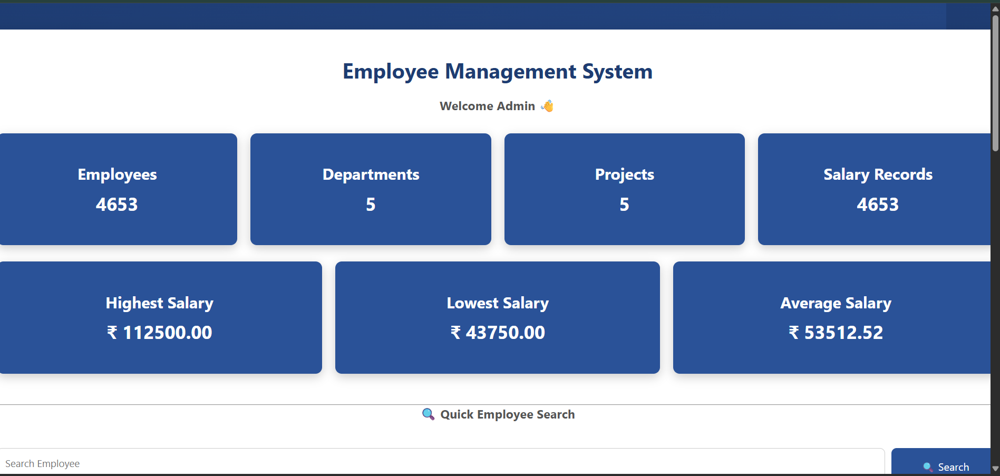
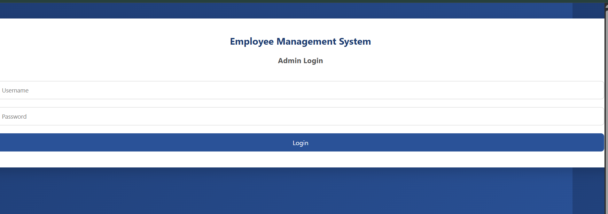
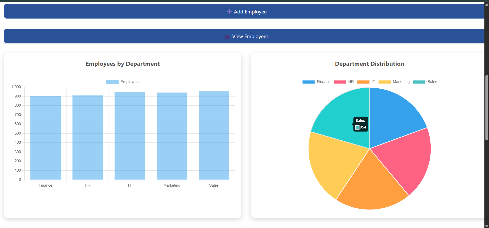
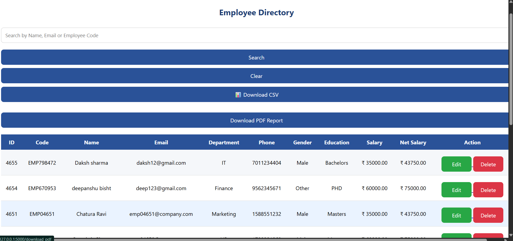

<div align="center">

# 🚀 Employee Management System

### Enterprise Employee Management Web Application using Flask & MySQL

<p align="center">

<p align="center">
  
</p>

A professional Employee Management System developed during my Software Development Internship at <b>50 Hertz, Delhi</b>.

Designed to automate employee management by replacing manual spreadsheet operations with a centralized web application featuring CRUD operations, dashboard analytics, graphical reports, PDF/CSV exports, and relational database management.

</p>

---


</div>

---

# 📌 Project Overview

Managing employee records manually through spreadsheets becomes increasingly difficult as an organization grows. This project provides a centralized Employee Management System that stores employee information securely in a MySQL database and offers an intuitive web interface for administrators.

The application was developed using **Python Flask** following the **MVC (Model-View-Controller)** architecture. It includes authentication, employee CRUD operations, dashboard analytics, salary management, graphical reports, search functionality, PDF/CSV export, and relational database design.

The project was built during my internship at **50 Hertz, Delhi**, where the primary objective was to create a practical, scalable, and maintainable employee management solution.

---

# ✨ Key Features

## 🔐 Authentication

- Admin Login
- Session Management
- Secure Logout
- Authentication Protected Routes

---

## 👨‍💼 Employee Management

- Add Employee
- View Employees
- Update Employee
- Delete Employee
- Employee Search
- Pagination
- Employee Code Generation

---

## 💰 Salary Management

- Automatic Salary Calculation
- Payment Tier Selection
- HRA Calculation
- Bonus Calculation
- Salary Deduction
- Net Salary Generation

---

## 📊 Dashboard Analytics

- Total Employees
- Total Departments
- Total Projects
- Salary Records
- Highest Salary
- Lowest Salary
- Average Salary
- Recently Added Employees

---

## 📈 Data Visualization

- Employees by Department (Bar Chart)
- Department Distribution (Pie Chart)
- Interactive Dashboard
- Real-Time Statistics

Powered by **Chart.js**

---

## 📄 Reports

- Export Employee Report as PDF
- Export Employee Report as CSV

---

## 🔍 Search

Quick employee search using:

- Employee Name
- Employee Email
- Employee Code

---

# 📸 Application Screenshots

## 🔑 Login Page



---

## 📊 Dashboard


---

## 📈 Dashboard Analytics



---

## 👨‍💼 Employee Directory



---

# 📊 Project Statistics

| Metric | Value |
|---------|------:|
| Backend Framework | Flask 3.1.3 |
| Programming Language | Python 3.13.7 |
| Database | MySQL 8.0.45 |
| Frontend | HTML5, CSS3, Jinja2 |
| Charts | Chart.js |
| Dataset Size | 4,653 Employee Records |
| Departments | 5 |
| Projects | 5 |
| Authentication | Session Based |
| Architecture | MVC Pattern |

---

# 🛠️ Technology Stack

## Backend

- Python
- Flask

## Frontend

- HTML5
- CSS3
- Jinja2
- JavaScript

## Database

- MySQL 8.0

## Visualization

- Chart.js

## Libraries Used

- Flask
- mysql-connector-python
- ReportLab
- CSV
- Jinja2

---

> **Current Version:** v1.0.0  
> **Status:** ✅ Stable Development Build

---

# 📂 Project Structure

```text
employee_management/
│
├── app.py                     # Main Flask application
├── config.py                  # Database configuration
├── database.py                # MySQL connection
├── requirements.txt           # Python dependencies
├── README.md                  # Project documentation
├── LICENSE                    # MIT License
├── .gitignore                 # Git ignored files
│
├── data/
│   └── Employee.csv           # Raw employee dataset (4653 records)
│
├── scripts/
│   └── import_data.py         # CSV to MySQL import script
│
├── static/
│   ├── style.css              # Global CSS
│   └── images/
│       ├── 50hertz.png
│       ├── login.png
│       ├── dashboard.png
│       ├── charts.png
│       └── employee_list.png
│
├── templates/
│   ├── login.html
│   ├── dashboard.html
│   ├── employees.html
│   ├── add_employee.html
│   └── edit_employee.html
│
└── __pycache__/
```

---

# ⚙️ Prerequisites

Before running this project, make sure the following software is installed on your system.

| Software | Version |
|-----------|----------|
| Python | 3.13+ |
| MySQL Server | 8.0+ |
| Git | Latest |
| VS Code | Recommended |

---

# 🚀 Getting Started

## 1. Clone the Repository

```bash
git clone https://github.com/Himan-stack/employee-management-system-flask.git
```

Move into the project directory.

```bash
cd employee-management-system-flask
```

---

## 2. Create a Virtual Environment

Windows

```bash
python -m venv venv
```

Activate it

PowerShell

```powershell
.\venv\Scripts\Activate.ps1
```

Command Prompt

```cmd
venv\Scripts\activate
```

Linux / macOS

```bash
source venv/bin/activate
```

---

## 3. Install Dependencies

```bash
pip install -r requirements.txt
```

---

## 4. Configure MySQL

Create a MySQL database.

```sql
CREATE DATABASE employee_management_v2;
```

Open **config.py**

Update your MySQL credentials.

```python
DB_HOST = "localhost"
DB_USER = "root"
DB_PASSWORD = "your_password"
DB_NAME = "employee_management_v2"
```

---

## 5. Import Dataset

Run the import script.

```bash
python scripts/import_data.py
```

This script:

- Reads the CSV dataset
- Cleans the data
- Inserts employee records
- Creates relational mappings
- Populates salary records

Dataset Size

**4,653 Employee Records**

---

## 6. Run the Application

```bash
python app.py
```

Flask starts on

```
http://127.0.0.1:5000
```

---

# 🔑 Default Development Credentials

> **For demonstration purposes only**

| Username | Password |
|----------|----------|
| admin | admin123 |

> **Note**
>
> These credentials are intended for local development only.
>
> In future versions, authentication will be upgraded using:
>
> - Password Hashing (bcrypt)
> - JWT Authentication
> - Role-Based Access Control (RBAC)

---

# 🌐 Application Workflow

```text
                User
                  │
                  ▼
          Login Authentication
                  │
                  ▼
        Flask Route (app.py)
                  │
                  ▼
        Business Logic Execution
                  │
                  ▼
          MySQL Database
                  │
                  ▼
       Retrieve / Update Records
                  │
                  ▼
         Jinja2 HTML Template
                  │
                  ▼
           Browser Response
```

---

# 🔄 Project Workflow

```text
                 CSV Dataset
                      │
                      ▼
             Data Cleaning Script
                      │
                      ▼
             MySQL Relational Database
                      │
                      ▼
          Flask Backend (Business Logic)
                      │
                      ▼
          Jinja2 HTML Templates
                      │
                      ▼
            Employee Management UI
                      │
                      ▼
        Dashboard • Charts • Reports
```

---

# 🗄️ Database Design

The application follows a relational database model.

## Main Tables

- employees
- departments
- projects
- salary
- employee_project

---

## Relationships

```text
Departments
      │
      │ 1
      │
      ▼
Employees
      │
      │ 1
      │
      ▼
Salary

Employees
      │
      │ M:N
      │
Employee_Project
      │
      ▼
Projects
```

---

# 📌 Features Implemented

✅ Admin Authentication

✅ CRUD Operations

✅ Session Management

✅ Employee Search

✅ Pagination

✅ Salary Calculation

✅ Department Management

✅ Project Allocation

✅ Dashboard Analytics

✅ Chart.js Integration

✅ PDF Export

✅ CSV Export

✅ Responsive Dashboard

---

# 📈 Current Project Status

| Module | Status |
|----------|--------|
| Authentication | ✅ Completed |
| CRUD Operations | ✅ Completed |
| Dashboard | ✅ Completed |
| Charts | ✅ Completed |
| Search | ✅ Completed |
| CSV Import | ✅ Completed |
| PDF Export | ✅ Completed |
| Pagination | ✅ Completed |
| Relational Database | ✅ Completed |
| Responsive UI | ✅ Completed |
| JWT Authentication | 🚧 Planned |
| Password Hashing | 🚧 Planned |
| REST API | 🚧 Planned |
| Nginx Deployment | 🚧 Planned |
| Docker Support | 🚧 Planned |
| AWS Deployment | 🚧 Planned |

---

# 🏗️ System Architecture

The Employee Management System follows a layered architecture that separates the presentation layer, business logic, and data access layer.

```text
                        User (Browser)
                               │
                               ▼
                    HTML + CSS + JavaScript
                               │
                               ▼
                      Flask Web Application
                               │
         ┌─────────────────────┼─────────────────────┐
         │                     │                     │
         ▼                     ▼                     ▼
     Authentication       CRUD Logic         Dashboard Analytics
         │                     │                     │
         └─────────────────────┼─────────────────────┘
                               ▼
                        MySQL Database
                               │
                               ▼
                    Employee Management Data
```

---

# 🔄 Flask Request Lifecycle

Every request follows the workflow below.

```text
Browser Request
       │
       ▼
Flask Route (app.py)
       │
       ▼
Validate Request
       │
       ▼
Business Logic
       │
       ▼
Database Query
       │
       ▼
Receive Result
       │
       ▼
Render Jinja Template
       │
       ▼
HTML Response
```

---

# ⚙️ Application Architecture

The project follows the MVC (Model-View-Controller) pattern.

## Model

Responsible for database operations.

Files

- database.py
- MySQL Tables

---

## View

Responsible for user interface.

Files

- login.html
- dashboard.html
- employees.html
- add_employee.html
- edit_employee.html

---

## Controller

Responsible for handling requests.

File

- app.py

Routes

- Login
- Dashboard
- Add Employee
- Edit Employee
- Delete Employee
- Download PDF
- Download CSV
- Logout

---

# 📌 Flask Concepts Used

This project helped implement several core Flask concepts.

| Concept | Purpose |
|----------|----------|
| Flask Routing | URL Mapping |
| Jinja2 Templates | Dynamic HTML Rendering |
| Sessions | Authentication |
| URL Routing | Navigation |
| Request Object | Form Handling |
| Redirect | Navigation Flow |
| Render Template | HTML Rendering |
| Flash Messages | User Notifications |
| POST Method | Insert/Update Operations |
| GET Method | Data Retrieval |

---

# 🗃️ SQL Concepts Used

The application makes extensive use of SQL for relational database management.

## Database Creation

```sql
CREATE DATABASE employee_management_v2;
```

---

## Table Creation

```sql
CREATE TABLE
```

---

## Primary Key

```sql
PRIMARY KEY
```

---

## Foreign Key

```sql
FOREIGN KEY
```

---

## Auto Increment

```sql
AUTO_INCREMENT
```

---

## Insert Records

```sql
INSERT INTO
```

---

## Update Records

```sql
UPDATE
```

---

## Delete Records

```sql
DELETE
```

---

## Retrieve Records

```sql
SELECT
```

---

## Aggregate Functions

```sql
COUNT()
AVG()
MAX()
MIN()
```

---

## Sorting

```sql
ORDER BY
```

---

## Grouping

```sql
GROUP BY
```

---

## Filtering

```sql
WHERE
```

---

## Pattern Matching

```sql
LIKE
```

---

## Joins

```sql
INNER JOIN
LEFT JOIN
```

---

# 📊 Dashboard Analytics

The dashboard displays real-time statistics directly from the database.

Metrics include:

- Total Employees
- Total Departments
- Total Projects
- Salary Records
- Highest Salary
- Lowest Salary
- Average Salary
- Recent Employees

These statistics are generated dynamically using SQL aggregate functions.

---

# 📈 Chart Generation

Chart.js is used for dashboard visualization.

Charts included:

### Employees by Department

Bar Chart

Uses SQL GROUP BY to count employees in each department.

---

### Department Distribution

Pie Chart

Displays percentage distribution of employees across departments.

---

# 🔍 Search Workflow

The search feature allows administrators to quickly locate employees.

Search Fields

- Employee Name
- Employee Email
- Employee Code

Implementation

```text
User Input

↓

Flask Route

↓

SQL LIKE Query

↓

Matching Employees

↓

Display Results
```

---

# 📄 Report Generation

## PDF Report

Implemented using ReportLab.

Includes

- Employee Code
- Name
- Email
- Department
- Salary
- Net Salary

---

## CSV Report

Uses Python's built-in CSV module.

Exports employee information directly from MySQL.

---

# 🔐 Authentication Flow

The current version uses session-based authentication.

Workflow

```text
Admin Login

↓

Validate Credentials

↓

Create Flask Session

↓

Access Protected Routes

↓

Logout

↓

Destroy Session
```

Current Development Credentials

```
Username : admin
Password : admin123
```

Future improvements

- bcrypt Password Hashing
- JWT Authentication
- Role-Based Authorization

---

# 📁 File Responsibilities

| File | Responsibility |
|------|----------------|
| app.py | Main Application Logic |
| config.py | Database Configuration |
| database.py | MySQL Connection |
| requirements.txt | Project Dependencies |
| import_data.py | CSV Import Script |
| style.css | Styling |
| templates/* | User Interface |
| static/images | Screenshots & Assets |

---

# 🚀 Planned Production Architecture

The application is currently running using Flask's built-in development server.

The production deployment architecture will be:

```text
Internet
      │
      ▼
   Nginx
      │
      ▼
 Gunicorn
      │
      ▼
 Flask Application
      │
      ▼
 MySQL Database
```

Benefits

- Reverse Proxy
- Better Performance
- Load Balancing Support
- SSL Termination
- Static File Serving
- Production Ready Deployment

---

# ☁️ Planned AWS Deployment

The production deployment roadmap is:

```text
Developer

↓

GitHub Repository

↓

AWS EC2

↓

Nginx

↓

Gunicorn

↓

Flask

↓

MySQL

↓

Users
```

Future deployment will include

- Amazon EC2
- Nginx
- Gunicorn
- Linux (Ubuntu)
- Git
- SSH
- Domain Mapping
- HTTPS using Let's Encrypt

---

# 🛣️ Project Roadmap

## Version 1.0 ✅

- Admin Authentication
- CRUD Operations
- Dashboard
- Search
- Pagination
- Charts
- CSV Import
- PDF Export

---

## Version 1.1 🚧

- Password Hashing
- JWT Authentication
- Employee Profile Page

---

## Version 1.2 🚧

- REST API
- Swagger Documentation

---

## Version 2.0 🚧

- Nginx
- Gunicorn
- Docker
- AWS EC2 Deployment

---

## Version 2.1 🚧

- CI/CD
- GitHub Actions
- Logging
- Monitoring
- Role-Based Access Control

---

# 🎓 Learning Outcomes

Developing this project significantly improved my understanding of full-stack web development and relational database design. Throughout the internship, I gained practical experience in designing, building, testing, and maintaining a real-world web application.

### Technical Skills Acquired

- Python Programming
- Flask Framework
- Jinja2 Templating
- HTML5 & CSS3
- MySQL Database Design
- Relational Database Modeling
- SQL Query Optimization
- CRUD Application Development
- Session-Based Authentication
- Dashboard Development
- Data Visualization using Chart.js
- CSV Data Processing
- PDF Report Generation
- Git & GitHub Version Control
- Project Documentation
- Software Debugging & Testing

---

# 💡 Challenges Faced

During the development of this project, I encountered several practical challenges.

### Challenge 1 — Importing CSV Data

**Problem**

The employee dataset contained over **4,653 records**, making manual database entry impractical.

**Solution**

Developed a Python script to automate CSV import and populate the MySQL database.

---

### Challenge 2 — Relational Database Design

**Problem**

Employees, Departments, Projects, and Salary information needed proper relationships.

**Solution**

Designed a normalized relational database using:

- Primary Keys
- Foreign Keys
- INNER JOIN
- One-to-Many Relationships
- Many-to-Many Relationships

---

### Challenge 3 — Dashboard Analytics

**Problem**

Managers required real-time employee statistics.

**Solution**

Used SQL aggregate functions:

- COUNT()
- AVG()
- MAX()
- MIN()
- GROUP BY

to generate dashboard metrics dynamically.

---

### Challenge 4 — Search Functionality

**Problem**

Finding employees manually from thousands of records was inefficient.

**Solution**

Implemented a search feature using SQL `LIKE` queries to search by:

- Employee Name
- Employee Email
- Employee Code

---

# 🚀 Future Enhancements

The following features are planned to further improve the application.

## Security

- Password Hashing (bcrypt)
- JWT Authentication
- Role-Based Access Control (RBAC)
- CSRF Protection
- Secure Environment Variables

---

## Backend

- REST API
- Flask Blueprints
- Modular Project Structure
- Logging
- Error Handling
- Unit Testing

---

## Deployment

- Nginx Reverse Proxy
- Gunicorn WSGI Server
- Docker Containerization
- AWS EC2 Deployment
- CI/CD using GitHub Actions

---

## Features

- Employee Profile Page
- Employee Image Upload
- Attendance Management
- Leave Management
- Payroll System
- Email Notifications
- Excel Export
- Advanced Dashboard Analytics
- Dark Mode

---

# ❓ Frequently Asked Questions (FAQ)

### Why Flask?

Flask is a lightweight Python web framework that provides flexibility, simplicity, and rapid development for web applications.

---

### Why MySQL?

MySQL is a reliable relational database that efficiently manages structured data and supports SQL queries and relationships.

---

### Why Chart.js?

Chart.js provides an easy way to create interactive and responsive charts for dashboard analytics.

---

### Why Session Authentication?

The current project uses Flask sessions for simplicity. Future versions will implement JWT authentication with password hashing.

---

### Why Relational Database?

A relational database maintains data consistency, avoids duplication, and supports efficient querying through relationships.

---

# 🧠 Interview Questions Based on this Project

If you're reviewing this project for an interview, you may be asked questions such as:

- Explain the overall architecture of the project.
- Why did you choose Flask?
- How does session authentication work?
- Explain the database relationships.
- How is the dashboard data generated?
- Which SQL queries are used for analytics?
- How does the search functionality work?
- How does Jinja2 render templates?
- Explain the CRUD workflow.
- Why is a virtual environment used?
- What improvements would you make for production deployment?
- What is the difference between Flask's development server and Gunicorn?
- Why is Nginx required in production?
- How would you deploy this application on AWS EC2?

---

# 🤝 Internship Acknowledgement

This project was developed as part of my Software Development Internship at **50 Hertz, Delhi**.

I sincerely thank my mentor **Mr. Lokender Singh** for his guidance, valuable feedback, and support throughout the development process.

The internship provided practical exposure to software development, database management, debugging, and real-world project workflows.

---

# 📄 License

This project is licensed under the **MIT License**.

Feel free to use, modify, and distribute this project for learning and educational purposes.

See the **LICENSE** file for more details.

---

# 👨‍💻 Author

## Himanshu

**B.Tech in Artificial Intelligence & Machine Learning**

Guru Gobind Singh Indraprastha University

Delhi
